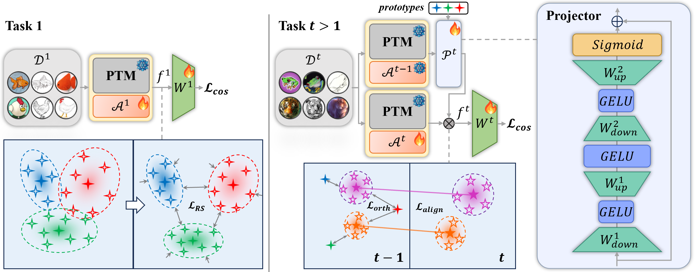

# Representation-Steered Incremental Adapter-Tuning for Class-Incremental Learning with Pre-Trained Models

  

This repository serves as the official implementation corresponding to the paper titled "Representation-Steered Incremental Adapter-Tuning for Class-Incremental Learning with Pre-Trained Models". 


## Installation
### Requirements
Ubuntu 20.04 LTS

Python 3.10

CUDA 11.8

Detailed package information and corresponding versions are available in the requirements.txt file.

### Data preparation

The overall directory structure should be:
```
RSIAT/
├──data/
├──datasets/
│   ├──cifar-100-python/
│   ├──cub/
│   ├──imagenet-a/
│   ├──imagenet-r/
│   ├──omnibenchmark/
│   ├──vtab/
│   ......
├──.......
```

## Training and evaluation

The training and evaluation instructions for each dataset are in the "./args.sh" file. Each dataset can be calculated separately, and the results are stored in the "./logs" folder.

Multi-GPU training runs in one process with `torch.nn.DataParallel`, which splits batches across all visible GPUs when at least two are available. The current model, frozen old model, and classifier calibration are all wrapped for multi-GPU forward passes. Set `num_worker` to `0` to force CPU; otherwise the requested count must not exceed the visible GPU count. You can set this in an experiment JSON or override it on the command line.

`data_loader_workers` separately controls the number of CPU workers used by each `DataLoader` (default: `8`); use `--data_loader_workers 0` to load data in the main process.

CUDA training uses automatic mixed precision by default (`--no-use_amp` disables it). The trainer selects bfloat16 when the GPU supports it and otherwise uses float16; AMP is disabled for quantum-simulator runs to retain their numeric stability. Validation runs after each task finishes, not after every epoch; task-wise accuracy is reported for all tasks seen so far.

For example, on one CUDA GPU, run `python main.py --config ./exps/adapter_imageneta.json --num_worker 1 --data_loader_workers 4`. For two GPUs, run `python main.py --config ./exps/adapter_imageneta.json --num_worker 2 --data_loader_workers 4`. Tune `data_loader_workers` to the CPU and storage speed, and tune `batch_size` to fit available GPU memory.

## Citation

If you find this useful in your research, please consider citing:

```text
@inproceedings{zhao2026representation,
  title={Representation-Steered Incremental Adapter-Tuning for Class-Incremental Learning with Pre-Trained Models},
  author={Zhao, Jiarui and Huang, Libo and Li, Xiangqi and An, Zhulin and Yang, Chuanguang and Wang, Yu and Diao, Boyu and Xu, Yongjun},
  booktitle={Proceedings of the IEEE/CVF Conference on Computer Vision and Pattern Recognition},
  pages={18010--18020},
  year={2026}
}
```

## Acknowledgement

This repo is based on [PILOT](https://github.com/LAMDA-CL/LAMDA-PILOT) and [SSIAT](https://github.com/HAIV-Lab/SSIAT).

Thanks for their wonderful work!!!
